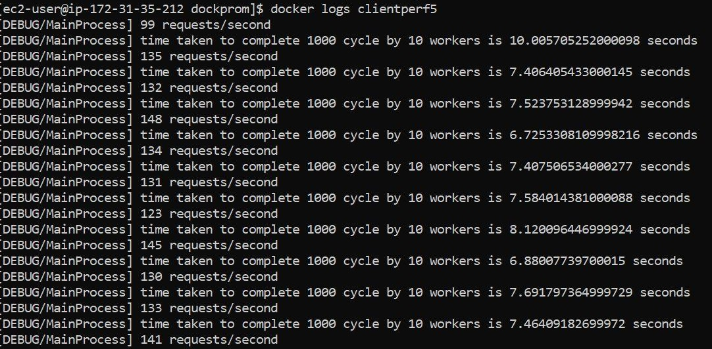

# Performance in Field Devices

## Modbus TCP communications

In the context of these performance tests the Modbus server represents the PLC while the client represents both the Robotic Arm and the AGV.

1. [How to build a client to conduct performance test.](../ModbusTCP/README.md)

### How to run the performance test

1. Go to ModbusTCP directory:

   ```console
   cd ~/PerformanceRoboticsFiware/ModbusTCP
   ```

2. Run the performace test considering the number of clients and server. E.g.: 32 clients x 1 server:

    > **Available options:** `1 client x 1 server`, `8 clients x 1 server`, `16 clients x 1 server` and `32 clients x 1 server`.

   ```console
   docker compose -f 1client-1server.yml up
   ```

3. Sample of request per seconds:

   

4. Preliminary results:

   | No. Clients | Min (req./s) | Max (req./s) |
   |:-----------:|:------------:|:------------:|
   |      1      |     1428     |     2010     |
   |      4      |      132     |      510     |
   |      8      |      66      |      286     |
   |      16     |      29      |      98      |
   |      32     |      38      |      44      |
