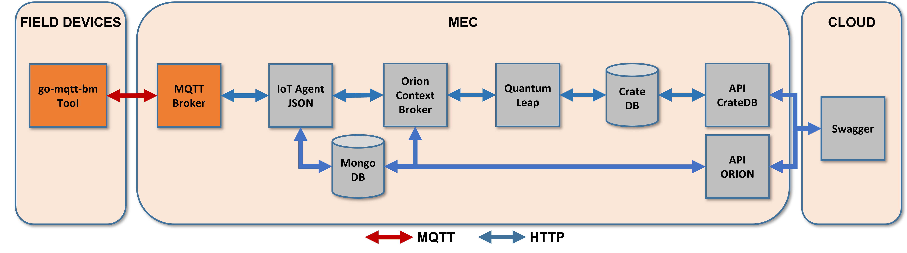
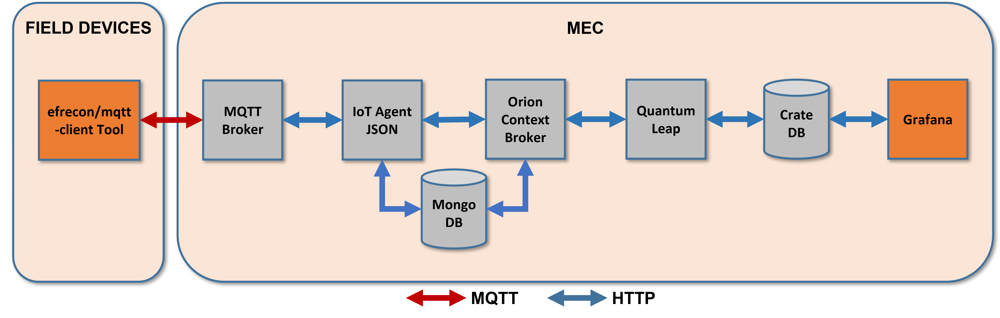

# Performance in MEC

## Determine the connection performance of MQTT clients on the Fiware broker

The [MQTT-benchmark](https://github.com/krylovsk/mqtt-benchmark) tool, which has been dockerized for use in this project, is used to measure the performance of message publishing over an MQTT broker.

  

1. [How to build the docker container](../MQTT/mqtt-benchmark-docker.md)

2. Use the *mqtt-benchmark* tool:

  ```console
  docker run -e "BROKER=mqtt://172.31.85.246:8883" \
           -e "COUNT=2" \
           -e "SIZE=100" \
           -e "CLIENTS=1000" \
           -e "TOPIC=/4jggokgpepnvsb2uv4s40d59ov/agv001/attrs" \
           sflorenz05/go-mqtt-bm
  ```

- Output:

    ```console
    {
        "runs": [
            {
                "id": 1,
                "successes": 2,
                "failures": 0,
                "run_time": 0.027207317,
                "msg_time_min": 0.290779,
                "msg_time_max": 11.25084,
                "msg_time_mean": 5.7708095,
                "msg_time_std": 7.749933455318214,
                "msgs_per_sec": 73.50963713180539
            },
            {
                "id": 0,
                "successes": 2,
                "failures": 0,
                "run_time": 0.027330115,
                "msg_time_min": 0.20848,
                "msg_time_max": 0.374784,
                "msg_time_mean": 0.291632,
                "msg_time_std": 0.1175946861384476,
                "msgs_per_sec": 73.17934812934377
            }
    ],
    "totals": {
        "ratio": 1,
        "successes": 4,
        "failures": 0,
        "total_run_time": 0.027368099,
        "avg_run_time": 0.027268716,
        "msg_time_min": 0.20848,
        "msg_time_max": 11.25084,
        "msg_time_mean_avg": 3.03122075,
        "msg_time_mean_std": 3.874363565574755,
        "total_msgs_per_sec": 146.68898526114916,
        "avg_msgs_per_sec": 73.34449263057458
        }
    }
    ```

## Determine the time taken for Grafana to consume a message

  

- As mentioned above, Grafana is a service that connects to the CrateDB database, which ensures data persistence.
- The performance test consists of determining the time it takes Grafana to consume published MQTT messages.
- For this purpose, using the `efrecon/mqtt-client` tool, given a topic and payload, both the number of messages and the frequency of message delivery are changed.
  - The *--repeat* option repeats the publication N times.
  - The *--repeat-delay* option waits time seconds between published messages.

  - MQTT-client execution:

  ```console
  docker run -it --rm --name mqtt-publisher --network \
    fiware_default efrecon/mqtt-client pub -h mosquitto -m "c|19" \
    -t "/ul/4jggokgpepnvsb2uv4s40d59ov/motion001/attrs" \
    --repeat 10 --repeat-delay 1 -d
  ```

  - Output:

  ```console
  Client (null) sending CONNECT
  Client (null) received CONNACK (0)
  Client (null) sending PUBLISH (d0, q0, r0, m1, '/ul/4jggokgpepnvsb2uv4s40d59ov/motion001/attrs', ... (4 bytes))
  Client (null) sending PUBLISH (d0, q0, r0, m2, '/ul/4jggokgpepnvsb2uv4s40d59ov/motion001/attrs', ... (4 bytes))
  Client (null) sending PUBLISH (d0, q0, r0, m3, '/ul/4jggokgpepnvsb2uv4s40d59ov/motion001/attrs', ... (4 bytes))
  Client (null) sending PUBLISH (d0, q0, r0, m4, '/ul/4jggokgpepnvsb2uv4s40d59ov/motion001/attrs', ... (4 bytes))
  Client (null) sending PUBLISH (d0, q0, r0, m5, '/ul/4jggokgpepnvsb2uv4s40d59ov/motion001/attrs', ... (4 bytes))
  Client (null) sending PUBLISH (d0, q0, r0, m6, '/ul/4jggokgpepnvsb2uv4s40d59ov/motion001/attrs', ... (4 bytes))
  Client (null) sending PUBLISH (d0, q0, r0, m7, '/ul/4jggokgpepnvsb2uv4s40d59ov/motion001/attrs', ... (4 bytes))
  Client (null) sending PUBLISH (d0, q0, r0, m8, '/ul/4jggokgpepnvsb2uv4s40d59ov/motion001/attrs', ... (4 bytes))
  Client (null) sending PUBLISH (d0, q0, r0, m9, '/ul/4jggokgpepnvsb2uv4s40d59ov/motion001/attrs', ... (4 bytes))
  Client (null) sending PUBLISH (d0, q0, r0, m10, '/ul/4jggokgpepnvsb2uv4s40d59ov/motion001/attrs', ... (4 bytes))
  Client (null) sending DISCONNECT
  ```

In the case of Δt<sub>6</sub> the measurement was done manually, retrieving the timestamp from Grafana. E.g., the time interval for test performance:


- Results:

    | Topic                                          | Payload | repeat (N) | repeat-delay (s) | Expected_time (s) | t0       | tf       | tf-t0(min) | tf-t0(s) |
    |------------------------------------------------|---------|------------|------------------|-------------------|----------|----------|------------|----------|
    | /ul/4jggokgpepnvsb2uv4s40d59ov/motion001/attrs | c\|55   | 100        | 0.5              | 50                | 00:43:19 | 00:44:09 | 00:00:50   | 50       |
    | /ul/4jggokgpepnvsb2uv4s40d59ov/motion001/attrs | c\|55   | 100        | 1                | 100               | 00:56:40 | 00:58:20 | 00:01:40   | 100      |
    | /ul/4jggokgpepnvsb2uv4s40d59ov/motion001/attrs | c\|55   | 1000       | 0.5              | 500               | 01:05:45 | 01:14:24 | 00:08:39   | 519      |
    | /ul/4jggokgpepnvsb2uv4s40d59ov/motion001/attrs | c\|55   | 1000       | 1                | 1000              | 01:20:59 | 01:37:47 | 00:16:48   | 1008     |