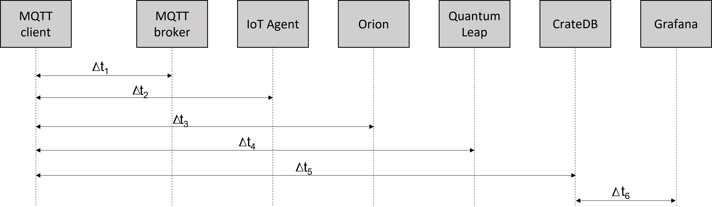

# Performance in MEC



## Determine the connection performance of MQTT clients on the Fiware broker (Δt<sub>1</sub>)

1. Install *mqtt-benchmark* tool on host:

   1. Install [nodejs](https://github.com/nodesource/distributions/blob/master/README.md)
   2. Install [nvm](https://github.com/nvm-sh/nvm#install--update-**script**)
   3. Set node version: `nvm i 13`, `nvm use 13`
   4. Install *mqtt-benchmark* tool: `npm install mqtt-benchmark -g`

2. Use the *mqtt-benchmark* tool:

  ```console
  mqtt-benchmark --broker=mqtt://localhost:1883 --topic="/ul/4jggokgpepnvsb2uv4s40d59ov/motion001/attrs"
  ```

- Output:

  ```console
  Average result for each client of the 1000 clients.
    Establishing connection (sec):   0.0042
    Success in publishing (msg):     100/100
    Failure in publishing (msg):     0/100
    Duraion in publishing (sec):     40.053
    Throughput (msg/sec):            2.6984
  ```

## Determine the time taken for Grafana to consume a message (Δt<sub>6</sub>)

- As mentioned above, Grafana is a service that connects to the CrateDB database, which ensures data persistence.
- The performance test consists of determining the time it takes Grafana to consume published MQTT messages.
- For this purpose, using the `efrecon/mqtt-client` tool, given a topic and payload, both the number of messages and the frequency of message delivery are changed.
  - The *--repeat* option repeats the publication N times.
  - The *--repeat-delay* option waits time seconds between published messages.

  - MQTT-client execution:

  ```console
  docker run -it --rm --name mqtt-publisher --network \
    fiware_default efrecon/mqtt-client pub -h mosquitto -m "c|19" \
    -t "/ul/4jggokgpepnvsb2uv4s40d59ov/motion001/attrs" \
    --repeat 10 --repeat-delay 1 -d
  ```

  - Output:

  ```console
  Client (null) sending CONNECT
  Client (null) received CONNACK (0)
  Client (null) sending PUBLISH (d0, q0, r0, m1, '/ul/4jggokgpepnvsb2uv4s40d59ov/motion001/attrs', ... (4 bytes))
  Client (null) sending PUBLISH (d0, q0, r0, m2, '/ul/4jggokgpepnvsb2uv4s40d59ov/motion001/attrs', ... (4 bytes))
  Client (null) sending PUBLISH (d0, q0, r0, m3, '/ul/4jggokgpepnvsb2uv4s40d59ov/motion001/attrs', ... (4 bytes))
  Client (null) sending PUBLISH (d0, q0, r0, m4, '/ul/4jggokgpepnvsb2uv4s40d59ov/motion001/attrs', ... (4 bytes))
  Client (null) sending PUBLISH (d0, q0, r0, m5, '/ul/4jggokgpepnvsb2uv4s40d59ov/motion001/attrs', ... (4 bytes))
  Client (null) sending PUBLISH (d0, q0, r0, m6, '/ul/4jggokgpepnvsb2uv4s40d59ov/motion001/attrs', ... (4 bytes))
  Client (null) sending PUBLISH (d0, q0, r0, m7, '/ul/4jggokgpepnvsb2uv4s40d59ov/motion001/attrs', ... (4 bytes))
  Client (null) sending PUBLISH (d0, q0, r0, m8, '/ul/4jggokgpepnvsb2uv4s40d59ov/motion001/attrs', ... (4 bytes))
  Client (null) sending PUBLISH (d0, q0, r0, m9, '/ul/4jggokgpepnvsb2uv4s40d59ov/motion001/attrs', ... (4 bytes))
  Client (null) sending PUBLISH (d0, q0, r0, m10, '/ul/4jggokgpepnvsb2uv4s40d59ov/motion001/attrs', ... (4 bytes))
  Client (null) sending DISCONNECT
  ```

In the case of Δt<sub>6</sub> the measurement was done manually, retrieving the timestamp from Grafana. E.g., the time interval for test performance:


- Results:

    | Topic                                          | Payload | repeat (N) | repeat-delay (s) | Expected_time (s) | t0       | tf       | tf-t0(min) | tf-t0(s) |
    |------------------------------------------------|---------|------------|------------------|-------------------|----------|----------|------------|----------|
    | /ul/4jggokgpepnvsb2uv4s40d59ov/motion001/attrs | c\|55   | 100        | 0.5              | 50                | 00:43:19 | 00:44:09 | 00:00:50   | 50       |
    | /ul/4jggokgpepnvsb2uv4s40d59ov/motion001/attrs | c\|55   | 100        | 1                | 100               | 00:56:40 | 00:58:20 | 00:01:40   | 100      |
    | /ul/4jggokgpepnvsb2uv4s40d59ov/motion001/attrs | c\|55   | 1000       | 0.5              | 500               | 01:05:45 | 01:14:24 | 00:08:39   | 519      |
    | /ul/4jggokgpepnvsb2uv4s40d59ov/motion001/attrs | c\|55   | 1000       | 1                | 1000              | 01:20:59 | 01:37:47 | 00:16:48   | 1008     |